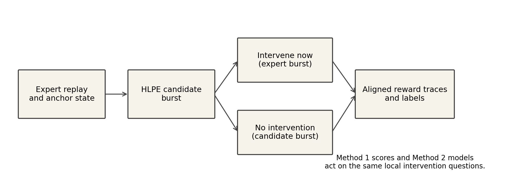
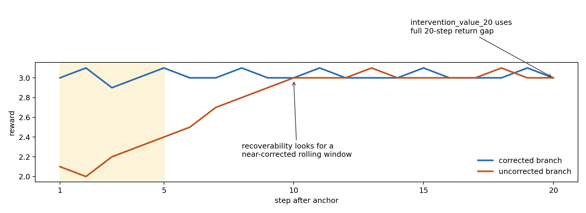
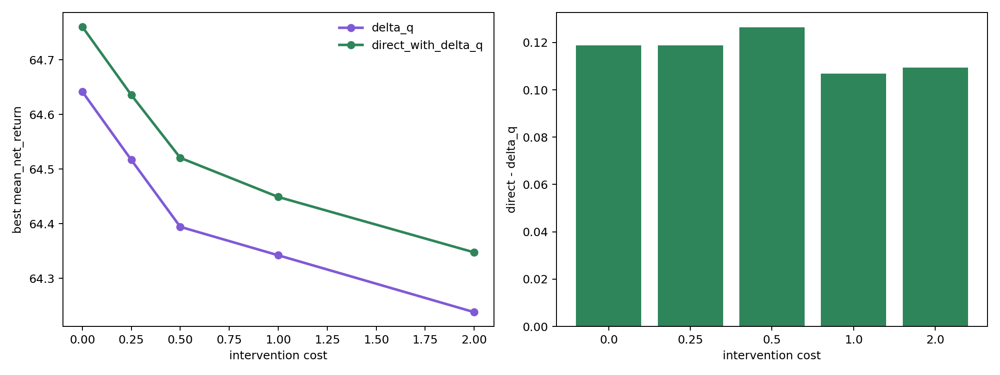
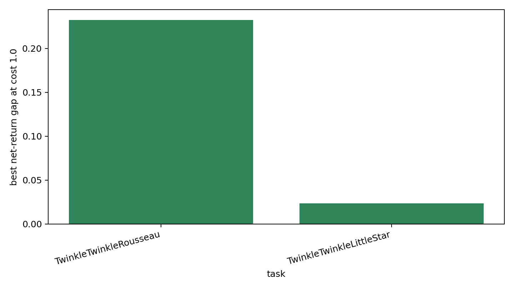

# From Local Harmfulness to Cost-Aware Teacher-Side Intervention in RoboPianist

EnYi Hou

McGill University

COMP400

April 2026

## Abstract

This paper examines teacher-side corrective intervention in RoboPianist. The starting point for the research was a more narrow result: a frozen expert SAC critic can provide a high-quality local harmfulness score, namely, the expert-relative critic gap $\Delta Q_t$, which is stored as `delta_q` in code and outperforms perturbation size-based baselines in local perturbation experiments. In this study, we retain the underlying idea and formulate a more decision-oriented hypothesis: at what points should the teacher choose to intervene, rather than allow an error to occur and potentially be recovered from? To address that question, we propose a new paired-branch benchmark, which measures the quality of interventions by comparing the immediate correction of an error with letting the candidate commit the mistake and keep playing under the same expert policy. The benchmark produces labels for short-term harm, self-recoverability, and intervention value. After that, we compare baselines from Method 1, which rely on $\Delta Q_t$, action-space distance, and perturbation size, against learned Method 2 models. The strongest model is `direct_with_delta_q`, which is a direct intervention-value predictor and incorporates $\Delta Q_t$ as a feature. The improvement of the model over the baseline is not high since the experiment involves a relatively short horizon of 20 steps. However, the performance gain remains stable across the cost-adjusted `mean_net_return` metric.

## Introduction

Not every imperfection should necessarily be corrected by a good teacher. On the one hand, there are obvious mistakes that should be corrected immediately. But on the other hand, many deviations will disrupt performance just momentarily, and the system might restore itself later. Once there is a cost associated with the correction, the former two situations should clearly be handled differently. In this paper, the goal is to understand how that decision can be made. That is, the core question is rather simple, but not trivial.

This work uses a reinforcement learning framework and the RoboPianist setup [2]. Reinforcement learning is concerned with observing a state, making an action, collecting reward, and relying on a policy, which is essentially a strategy for making decisions in future states. State-action value, or Q-value, $Q(s, a)$ measures the expected future reward after applying action $a$ to state $s$ and then continuing the process using the policy further. Here, the policy is defined using SAC expert checkpoints [1], with expert actions and critic evaluations included as well.

Previous research on the Delta-Q question involved using the expert critic to compare the difference between the expert action $a_t^\ast$ and another candidate action $\tilde{a}_t$ in the context of the observed state. Specifically, the critic-gap local score was estimated as:

$$
\Delta Q_t = \min(Q_1, Q_2)(s_t, a_t^\ast) - \min(Q_1, Q_2)(s_t, \tilde{a}_t).
$$

Here $Q_1$ and $Q_2$ are the two SAC critics, and the minimum is used to obtain a conservative value estimate.

Positive $\Delta Q_t$ indicates that the expert action is preferred by the critic in this particular state. Previous research raised an interesting question concerning the capacity of that measure to predict damage better than simple baselines like size of deviation. This paper keeps the core elements, but asks a different and perhaps more actionable question: when does the teacher need to intervene?

Methods being compared here are two groups of interventions. In the first approach, a set of predefined and hand-tuned local signals is used: the critic-gap score $\Delta Q_t$, action L2 distance, and perturbation magnitude. In the second approach, paired-branch data is used to learn an intervention rule. For evaluating the results, cost-adjusted `mean_net_return` is used as the key metric. When the intervention cost is zero, intervening always is the zero-cost upper bound, as unnecessary corrections do not matter anymore. But when positive intervention cost is introduced, things become much harder, and the teacher needs to decide when and where to intervene.

Contributions of this paper can be summarized as follows. Firstly, we have reformulated the original Delta-Q harmfulness estimation problem into an intervention problem accounting for intervention costs. Secondly, we propose a paired-branch evaluation scheme taking short-term harm, self-recovery capacity, and benefit from intervention into account. Thirdly, we compare strong local hand-crafted signals against learned intervention models under factorized and direct settings. Finally, we find that among all learned intervention variants, `direct_with_delta_q` beats the plain critic-gap baseline in terms of cost-adjusted `mean_net_return` on the selected HLPE benchmark when intervention cost is positive.

The conclusion drawn from these data is rather specific. It is not a paper about human teaching, nor is it an online student-adaptation study. And most certainly, it is not a general claim about learned intervention models being superior to critic-based signals. Instead, this is a benchmarking paper relying on carefully chosen HLPE data. The contribution here is in showing that although critic gap is a great local signal, the combination of critic gap and other signals works better in learned intervention models on the selected HLPE benchmark.

## Problem Framing and Terminology

This work concerns teacher-side corrective intervention. Specifically, a student takes an initial action, a teacher observes that action, and the teacher decides whether to replace that action with the expert action. Consequently, the object of this paper is a local decision about intervention, rather than a broad theory of teaching.

### Local Harmfulness

The measure of local harmfulness is how much immediate damage is done by letting the current candidate action go unchecked. The label `harm_5` corresponds directly to this concern, being the difference between corrected and uncorrected rewards within five steps into the future in this benchmark study.

### Self-Recoverability

The self-recoverability of an uncorrected state measures whether the uncorrected branch can recover quickly enough without intervention. Self-recoverability is assessed in this paper through rolling 5-step reward windows in the 20 steps immediately following observation of the action. The measure of recoverability considered here is relevant to intervention decisions, but does not represent the claim that only two factors always matter in teaching situations.

### Intervention Value

Intervention value represents the reward benefit gained by intervening in the student trajectory at that point in time instead of abstaining. `intervention_value_20` measures exactly this, taking as input the difference between corrected 20-step and uncorrected 20-step returns for an intervention at a certain point in time, where this point defines a decision boundary between intervention and no intervention.

### Shared Autonomy and Corrective Assistance

The term shared autonomy generally denotes continual co-control between a human and an aiding controller [3, 4]. The term corrective assistance is used to describe more varied forms of assistance, including overriding control or local intervention. Shared autonomy does not describe our setting, as the teacher does not blend actions with the student. The problem is instead whether the teacher should intervene or not.

### Learner-Side Help-Seeking

A related body of work examines whether a controlled system should seek help based on its own observations [5, 6]. This is not the focus of the present work, since the student does not seek out any form of aid and the teacher makes an intervention versus non-intervention decision after observation of the candidate action.

### Position of This Paper

This paper takes up a specific problem statement within an important literature: a benchmark for local teacher-side correction in a RoboPianist setting built upon a robust critic-based algorithmic baseline and explicitly considering intervention cost.

### Related-Work Context

One short positioning point helps here. Relative to the old Delta-Q project, the present paper changes the question from local action scoring to local intervention. Relative to shared-autonomy or corrective-assistance work, the present benchmark does not study continuous action blending with a human. Relative to learner-side help-seeking, the student does not ask for help at all. The teacher sees a deviation and decides whether correction is worth paying for.

## From the Delta-Q Project to Teacher-Side Intervention

Whereas the original Delta-Q project investigated a much more specific question, this paper takes a broader approach. Specifically, the project asked if a frozen expert critic was able to measure the local action quality better than simple baselines representing the perturbation size. At observation $s_t$, expert action $a_t^\ast$ and proposed action $\tilde{a}_t$ were considered. Their critic-gap score was defined as:

$$
\Delta Q_t = \min(Q_1, Q_2)(s_t, a_t^\ast) - \min(Q_1, Q_2)(s_t, \tilde{a}_t),
$$

which was a critic-gap score in the sense of the two-headed SAC implementation.

For the original project, there were also two simple baselines: the action L2 distance between the original and proposed actions,

$$
d_{\mathrm{L2},t} = \lVert \tilde{a}_t - a_t^\ast \rVert_2.
$$

and perturbation magnitude, understood as the scaling coefficient used to produce the perturbation. For Gaussian data, perturbation magnitude is equal to the base noise standard deviation multiplied by the severity parameter of the perturbation. For matched-L2 data, it is equal to the requested perturbation norm. For HLPE data, it is equal to the requested structured-error scale. Therefore, action L2 distance and perturbation magnitude are connected but distinct metrics: the former measures the executed difference, while the latter is the control variable.

In any case, the original one-step experiment showed that $\Delta Q_t$ demonstrated the best correlation with downstream reward drop and the largest $R^2$ among the three local variables tested. This fact is crucial in the sense that Method 1 starts from a good baseline, not from a poor one.

| Signal | Pearson r | Spearman rho | Single-feature $R^2$ |
| --- | ---: | ---: | ---: |
| $\Delta Q_t$ | `0.524` | `0.766` | `0.275` |
| Perturbation magnitude | `0.410` | `0.607` | `0.168` |
| Action L2 distance | `0.389` | `0.606` | `0.151` |

It was checked whether $\Delta Q_t$ could be viewed as yet another representation of perturbation size. For this purpose, the same templates of perturbations were applied several times while keeping the magnitude fixed. If $\Delta Q_t$ would depend solely on perturbation size, then it should not have varied noticeably under that control. However, this metric still showed variation across timesteps and maintained predictive significance. Put differently, the critic-gap score responded to context in some way, but not only to perturbation magnitude.

Additionally, horizon analysis showed that $\Delta Q_t$ was mostly significant as a short-horizon damage indicator. This makes it an ideal candidate for a benchmark of local harmfulness. At the same time, the original Delta-Q project showed the limitation of purely local harmfulness. Indeed, for the teacher, it is equally important to assess not only the current harmfulness of the action, but also the chance of recovery if no intervention happens. Thus, this benchmark focuses on two other factors that are crucial for local decisions: damage level and chance of recovery.

The methodological path through the paper can be briefly described as follows. We first considered a factorized Method 2 model as being closer to the concept: in order to intervene, both the level of damage and the likelihood of recovery must be known. Afterward, we included a direct intervention-value model, which directly predicts the decision quantity. As can be seen from the experimental results, the direct model was better operationally, especially `direct_with_delta_q`, whereas the factorized one was helpful interpretatively.

## Benchmark and Dataset Pipeline

### Dataset Objective

The objective of the dataset is to turn potential interventions at each local point into supervised instances that can be used to fairly evaluate hand-crafted and learned intervention policies. Each instance starts from the same anchor state and records outcomes from two branches: intervene now, or do not intervene now.

### Pipeline

The benchmark has the following pipeline for all examples:

- Run an expert checkpoint of a trained model in RoboPianist and get the expert trace.
- Select an anchor step from that trace.
- Generate an instance-specific candidate error at that anchor.
- Branch off from the same anchor step to an intervene-now trace and a no-intervention trace.
- Save the corresponding reward traces and generate the labels.
- Train and evaluate intervention policies on that data.

By replaying to the same anchor state, the pipeline makes sure that we measure only the local consequences of the current mistake while leaving the continuation policy unchanged. Thus, the benchmark is specifically not an online student-learning scenario, not a teacher-student co-training system, and not a human-data benchmark.

### Labels

The benchmark stores aligned reward traces of 20 steps for both branches and calculates three key labels. Short-term harm is:

$$
\text{harm}_5 = \sum_{i=1}^{5} r^{\mathrm{corr}}_{t+i} - \sum_{i=1}^{5} r^{\mathrm{uncorr}}_{t+i},
$$

measuring the local impact of the current mistake. Recoverability is a binary label, `recoverable_20`, measuring whether the uncorrected trace comes close to the local performance of the corrected trace within 20 steps. Recovery is counted in the production benchmark if there exists at least one rolling 5-step period in which the reward in the uncorrected branch matches the corrected branch at the threshold of `1.0`, in which case `time_to_recovery_20` is the first step where it happens. Value of intervention is:

$$
\text{intervention\_value}_{20} = \sum_{i=1}^{20} r^{\mathrm{corr}}_{t+i} - \sum_{i=1}^{20} r^{\mathrm{uncorr}}_{t+i},
$$

calculating the value of the intervention in terms of cumulative 20-step reward gain. Cost of intervention is not considered in the label itself, but is added later when evaluating policies in the benchmark.

### Why Both Branches Should Have Expert Continuation

After a single step or burst of actions, both branches go back to expert continuation. For burst types, this means that the intervene-now branch takes the expert burst followed by expert policy, while the no-intervention branch takes the corrupted burst, after which it follows the expert policy. This makes the resulting dataset simpler to analyze. The idea is to estimate local benefit in correction while the continuation policy remains constant. That is also why the reward differences remain relatively low between branches: both are set back to expert policy after local deviation.

### Human-Like Proxy Errors

The headline benchmark uses structured perturbations categorized as Human-Like Proxy Errors, or HLPE. These errors are intended to be more human-like proxies than the standard one-step Gaussian noise. However, HLPEs are not supposed to be realistic human motor models. They simply make the dataset richer in error cases where first-step badness, recoverability, and intervention value may differ.

| Family | Share | Construction | Example interpretation |
| --- | ---: | --- | --- |
| Lagged action error | `34.375%` | The candidate action partly repeats the previous action for several steps instead of matching the current expert action. | A delayed finger movement that stays behind the intended timing. |
| Persistent sparse bias | `31.250%` | The same signed offset is applied to a few action dimensions for several consecutive steps. | A short period of consistent overshoot caused by temporary tension or posture bias. |
| Sparse sign template | `25.000%` | A fixed signed push is applied to a small subset of action dimensions for one or two steps. | A repeated local coordination slip in part of the hand. |
| Short burst noise | `9.375%` | Temporally correlated noise is added over a short burst. | A brief stumble or transient loss of control. |

## Methods

### Method 1: Local Trigger Baselines

Method 1 associates a single local signal with each intervention opportunity and then makes an intervention or non-intervention decision based on that score. The three Method 1 signals are $\Delta Q_t$, the action L2 distance, and perturbation magnitude. In code and saved artifacts, the first of these is still named `delta_q`. Crucially, all three are local measures even when the candidate error spans several timesteps. The reason for this is to allow the paper to explore whether a single score is sufficient, or if the learned model benefits from a richer representation of recoverability and context in this case.

### Method 2: Learned Intervention Models

The evaluation explores two families of learned shared-MLP models. In the factorized model, the learner predicts `harm_5` and `recoverable_20` separately and combines the predictions to produce the decision score,

$$
\text{factorized score} = \widehat{\text{harm}}_5 \left(1 - \hat{p}(\text{recoverable}_{20})\right).
$$

In words, the factorized model assigns high scores where the predicted harm is high and the predicted recoverability is low. By contrast, the direct model predicts `intervention_value_20` directly. `intervention_value_20` is a closer match to the target of the overall algorithm since the decision relies on intervention value relative to intervention cost. Both families of models are evaluated both with and without `delta_q` as a feature, generating `factorized_no_delta_q`, `factorized_with_delta_q`, `direct_no_delta_q`, and `direct_with_delta_q` policies.

### Model Inputs and Architecture

Both families of models rely on a shared MLP backbone. The feature representation comprises:

- the flattened observation at the anchor state,
- the expert action at the anchor state,
- the candidate first action,
- the action difference between candidate and expert action,
- scalar features: progress, action L2 distance, perturbation magnitude, burst length, support size, and lag alpha,
- one-hot task identity,
- one-hot candidate-family identity,
- one-hot HLPE subfamily identity,
- optionally, `delta_q`,

where support size refers to the number of action dimensions changed by a structured error and lag alpha is the weight of the previous action in the lagged-action family.

The network configuration is:

- hidden layers: `(256, 256)`,
- activation function: the MLP activation used in the Flax implementation,
- optimizer: Adam,
- learning rate: `3e-4`,
- batch size: `128`,
- number of training epochs: `50`.

### Decision Rules

Three intervention decision rules are evaluated. Budgeted intervention selects the highest-scored fraction of rows. Threshold intervention selects rows where the computed score exceeds the specified threshold. Value-cost rule, applied only to the direct family, selects the rows where the predicted intervention value is greater than the intervention cost. Assuming intervention cost `c`, the net return of a row is

$$
\text{net return} = \text{chosen 20-step return} - c \cdot \mathbf{1}[\text{intervene}],
$$

where $\mathbf{1}[\cdot]$ is the indicator function, and the headline metric of interest is the mean net return across rows,

$$
\texttt{mean\_net\_return} = \mathbb{E}\!\left[\text{chosen return} - c \cdot \mathbf{1}[\text{intervene}]\right].
$$

For example, consider a situation where an intervention increases 20-step return by `0.4`, from `8.2` to `8.6`. If intervention cost is `0.25`, it is worthwhile on that row. If the cost is `0.5`, it is not anymore worth intervening to correct the error.

### Why `direct_with_delta_q` Is the Headline Method 2 Policy

The factorized model was introduced first as a matching decomposition of the problem. However, the direct model better captures the actual decision quantity of interest, which made it the headline intervention method.

### Method Family as an Ablation Map

It also helps to say plainly what the method names are actually varying. The table below is meant as a map of the ablation family, not as a second winner table.

| Method | Uses `delta_q`? | Score or target | What changes |
| --- | --- | --- | --- |
| `delta_q` | yes | local critic-gap score | strongest handcrafted local trigger |
| `action_l2_distance` | no | executed action difference | geometric action-distance trigger |
| `perturbation_magnitude` | no | requested scale | generation-time size signal |
| `factorized_no_delta_q` | no | predicted harm and recoverability | learned context without critic gap |
| `factorized_with_delta_q` | yes | predicted harm and recoverability | same decomposition with critic gap added |
| `direct_no_delta_q` | no | predicted intervention value | direct target without critic gap |
| `direct_with_delta_q` | yes | predicted intervention value | direct target with critic gap |

## Experimental Setup

### Expert Checkpoints Used

The headline comparison uses five expert checkpoints. Three checkpoints are different seeds of `TwinkleTwinkleLittleStar`, and two are `TwinkleTwinkleRousseau` and `CMajorScaleTwoHands`. These checkpoints are used since they have high performance and high key-press F1 scores, which means that they are credible teachers for this benchmark. Key-press F1 reflects how much played notes agree with the target notes, thus being an easy check on whether the expert policy executes the music piece successfully or not.

| Piece / task | Seed | Total reward | Key-press F1 |
| --- | ---: | ---: | ---: |
| Twinkle Twinkle Little Star | `42` | `537.05` | `0.942` |
| Twinkle Twinkle Little Star | `7` | `539.51` | `0.963` |
| Twinkle Twinkle Little Star | `123` | `539.11` | `0.930` |
| Twinkle Twinkle Rousseau | `42` | `511.82` | `0.878` |
| C Major Scale Two Hands | `42` | `501.66` | `0.888` |

### Selected HLPE Benchmark

The headline dataset uses a selected HLPE mixture on top of those five expert checkpoints. The reason for this choice is to enhance mistake variety and make perturbations closer to human-like proxies rather than one-step noise. This benchmark consists of `14,464` rows and preserves first-step local baselines while increasing variation in structured deviations that Method 2 must distinguish.

| Statistic | Value |
| --- | ---: |
| Total rows | `14,464` |
| Train / val / test | `10,848 / 1,856 / 1,760` |
| Positive intervention-value fraction | `0.679895` |
| Positive harm fraction | `0.733684` |
| Recoverable fraction | `0.867879` |
| Lagged action share | `0.34375` |
| Persistent sparse bias share | `0.31250` |
| Sparse sign template share | `0.25000` |
| Short burst noise share | `0.09375` |

These statistics allow us to get a brief overview of the decision problem. Positive intervention-value ratio is the proportion of times when intervention helps over the next 20 steps. Positive harm ratio is the proportion of times when candidate action leads to temporary damage within the next 5 steps. Recoverable ratio stands for the number of times when not executing an intervention still leads to recovery toward almost corrected local performance. Taken together, these numbers show the presence of many harmful cases and many recoverable cases in this particular benchmark, which is exactly what intervention should select. Finally, subfamily shares confirm the dominating type of lagged and persistent structured mistakes in this benchmark.

### Evaluation Settings

All headline benchmarks are evaluated via cost-adjusted `mean_net_return` at intervention costs `0`, `0.25`, `0.5`, `1.0`, and `2.0`. Raw reward is also considered as an additional indicator, but the main question of this paper is about intervention efficiency.

### Protocol Details

One practical detail is worth stating plainly. The direct family is supervised on the intervention-value label itself. The factorized family is supervised on the harm and recoverability labels, then turns those predictions into a single decision score. The learned models use the fixed architecture listed above and a fixed epoch budget rather than early stopping.

When threshold-based rules are used, thresholds are chosen on validation and transferred unchanged to test. The headline cost tables are reported on held-out test rows.

### Split and Leakage Note

Rows are split by `anchor_id`, not by individual perturbation row. That means all candidate variants produced from the same anchor state stay in the same split. This avoids direct anchor leakage, and the dataset audit checks that no `anchor_id` appears in more than one split. At the same time, nearby anchors from the same rollout can still end up in different splits, and checkpoints are not held out wholesale. So the main test here is generalization to unseen local intervention examples within seen tasks and seen teacher checkpoints, not a full task-held-out transfer test.

## Results

### Overall Cost-Adjusted Performance

The first result follows directly from the experiments. Once there is a nonzero intervention cost, `direct_with_delta_q` becomes the best policy among the tested methods in the selected HLPE benchmark.

| Intervention cost | Best method | Intervention rate | Mean net return |
| --- | --- | ---: | ---: |
| `0.00` | `always_intervene` | `1.000000` | `67.683626` |
| `0.25` | `direct_with_delta_q` | `0.254545` | `67.587761` |
| `0.50` | `direct_with_delta_q` | `0.226705` | `67.526708` |
| `1.00` | `direct_with_delta_q` | `0.179545` | `67.425106` |
| `2.00` | `direct_with_delta_q` | `0.100000` | `67.299154` |

In particular, at intervention cost `0`, `always_intervene` becomes the upper bound, since interventions are costless and unnecessary interventions do not reduce performance. Even at zero intervention cost, the learned value model gets quite close to the upper bound: the mean net return of `always_intervene` is `67.683626`, while the mean net return of `direct_with_delta_q` is `67.683462`, less than `0.000164` away. While this does not mean that `direct_with_delta_q` is the best zero-cost policy, it indicates that the learned value model captures the intervention signal very accurately. At each positive intervention cost, `direct_with_delta_q` is the best among the discussed policies while being selective in its use of interventions. The intervention rate goes down from `0.254545` at cost `0.25` to `0.100000` at cost `2.0`.

### Direct Versus Factorized Learned Models

The next relevant result refers to the relative strengths of the two families of learned models. It should come as no surprise that the direct models perform better than their factorized counterparts. Although the factorized model may be useful because of the scientific insight it provides, namely the separation between the harm score and the recoverability score, the direct value-based target better matches the final decision problem. As a result, in the comparison discussed above, `direct_with_delta_q` is clearly superior, and the factorized learned models are consistently worse.

The learned-family ablation is also useful on its own. In the table below, recoverability AUROC means the area under the receiver-operating-characteristic curve for the binary `recoverable_20` label.

| Model | Uses `delta_q`? | Best net return | Value MAE | Harm MAE | Recoverability AUROC |
| --- | --- | ---: | ---: | ---: | ---: |
| Direct w/o dq | no | `67.6749` | `0.6138` | - | - |
| Direct with dq | yes | `67.6813` | `0.5916` | - | - |
| Factorized w/o dq | no | `67.6499` | - | `0.2988` | `0.8046` |
| Factorized with dq | yes | `67.6460` | - | `0.3006` | `0.7936` |

Two ablation points come out of this table without much drama. Adding critic gap helps the direct family. Replacing the factorized target with the direct intervention-value target helps more. The factorized models still matter in the paper because they expose harm and recoverability separately. They just do not end up being the strongest deployment rule.

### Intervention Selection Versus Intervention Score

The comparison between the strongest handcrafted intervention selector and the best learned value-based intervention model is the main result of the paper.

| Intervention cost | `direct_with_delta_q` | `delta_q` | Gap |
| --- | ---: | ---: | ---: |
| `0.25` | `67.587761` | `67.520356` | `+0.067405` |
| `0.50` | `67.526708` | `67.445356` | `+0.081352` |
| `1.00` | `67.425106` | `67.358677` | `+0.066428` |
| `2.00` | `67.299154` | `67.254297` | `+0.044857` |

### Reliability Note

The gap is small, so the natural reader question is whether it is just noise. The current manuscript can support a careful answer, but not an overly broad one. Across the four positive intervention costs reported above, the learned-minus-`delta_q` gap never changes sign. It ranges from `+0.044857` to `+0.081352`, with a mean of `+0.065011`. The task-level comparison also does not flip sign on the held-out tasks that actually appear in the plot. That is enough for a narrow pattern claim. More specifically, the reported learned-model comparison comes from one training seed per model in the pipeline rather than a seed sweep, so the paper does not claim variance estimates across multiple learned-model seeds.

While the numerical advantages of `direct_with_delta_q` may appear small at first, the important pattern here is consistency. Even at small positive costs, the learned model selects interventions more selectively, leading to an increase in performance. This should not be too surprising, given the specifics of the benchmark, namely:

- each case is defined by a short local sequence,
- both branches continue with expert policy,
- the episode horizon is 20 steps long,
- most mistakes made can be recovered from.

These factors create a local decision problem rather than a global rescue problem. The local design of the environment therefore makes a small improvement in intervention selection manifest as a small absolute change in reward.

### `direct_with_delta_q` Versus `delta_q` Across Pieces

Finally, the last notable experimental result is the cross-piece comparison of the two strongest methods. While the advantage varies from one piece to another, the direction remains favorable to the learned direct model across the pieces represented in the headline benchmark.

`C Major Scale Two Hands` belongs to the benchmark definition, but it does not appear in the piece-level plot because under the anchor-level split used here, its sampled rows did not land in the held-out test split.

## Discussion

The first discussion point is simple: the critic-gap baseline stays strong. Unmodified plain `delta_q` remains the strongest handcrafted Method 1 feature, while the best learned model continues to use it as an input. The work should be interpreted as an effort to go beyond the critic gap, not as a call to abandon it. Critic gap is good enough for certain tasks. The benchmark confirms that it is good, but not sufficient.

Secondly, framing the problem in terms of intervention instead of action scoring does matter. Local harmfulness and intervention value are two separate properties. An action could be locally harmful, yet recoverable enough that correction is not worthwhile once intervention cost is taken into account. The key distinction here is exactly what the paired-branch benchmark was meant to highlight. `harm_5`, `recoverable_20`, and `intervention_value_20` create a clear distinction between "bad action" and "worth correcting."

The third point to discuss is model design. While the factorized approach was the right starting point because it corresponded well to the conceptual decomposition of the problem, the final results favor a single head that directly predicts the target intervention score. This is informative. It suggests that for this particular benchmark, a direct prediction of the final score is better than the assembly of a decomposed score using separate heads.

Fourthly, benchmark design plays a key role in interpreting the results. As explained above, the selected mixture of HLPEs increases the number of distinct errors and makes their distribution closer to human-like errors without fully transforming them into actual human motor behavior. This benchmark still remains local and largely recoverable, so the improvements in performance cannot be considered revolutionary. The important result is not that the learned model improves performance by some huge margin. Rather, the important result is that in this intervention regime, the model uses the available interventions more efficiently than the best local handcrafted baseline.

## Limitations

This paper does not use data from human novices. Human-Like Proxy Errors, although valuable in expanding the diversity of possible errors, are still generated inside RoboPianist as proxies for actual human mistakes. The paper therefore demonstrates a result concerning robot-generated human-like proxies, not a result concerning real human behavior during piano lessons.

Expert continuation from both branches is also important for the current study because it allows isolating the local intervention decision and keeping the benchmark simple to interpret. On the other hand, it means that student behavior does not adapt to feedback during the episode. The current results therefore do not cover what happens when that adaptation occurs.

As explained before, the benchmark is local, with the horizon set to 20 steps ahead. The focus on short-term interventions reduces the magnitude of expected improvements, since methods that optimize short-term correction efficiency may produce only modest numerical gains even if they solve the local task well.

Lastly, benchmark coverage is relatively narrow. The benchmark is based on five expert checkpoints from three pieces. Three of those checkpoints come from the same piece, but are generated with different seeds. Although such a selection allows making a well-informed benchmark claim, it does not imply broader coverage.

The listed limitations do not negate the contributions of this research. They limit its applicability scope to a specific RoboPianist benchmark.

## Conclusion

In sum, the original Delta-Q question received a positive answer and produced a strong local baseline, while this paper extends that result in a new direction:

> Does local harmfulness alone make a good HLPE intervention strategy?

As far as the selected HLPE benchmark is concerned, the answer is clearly no. Using only a single local critic-gap score as a full intervention rule in a cost-sensitive setting is suboptimal compared with a learned policy that predicts intervention value using `delta_q` as a contextual feature. This improvement is relatively small because of how localized the benchmark is, but it remains consistently positive in the reported comparison.

The most defensible conclusion is thus:

> In this RoboPianist teacher-side intervention benchmark, `delta_q` is a strong local harmfulness baseline, but a learned intervention model that incorporates `delta_q` together with contextual features yields better cost-aware intervention decisions on the selected HLPE dataset.

The next step, of course, is not to overreach by claiming too much about human intervention techniques. It is rather to broaden the HLPE benchmark itself by using richer proxy-error families, more task types, and contexts where continuation is not constrained to follow the expert.

## References

1. Tuomas Haarnoja, Aurick Zhou, Pieter Abbeel, and Sergey Levine. *Soft Actor-Critic: Off-Policy Maximum Entropy Deep Reinforcement Learning with a Stochastic Actor.* In Proceedings of the 35th International Conference on Machine Learning, 2018.
2. Kevin Zakka, Philipp Wu, Laura Smith, Nimrod Gileadi, Taylor Howell, Xue Bin Peng, Sumeet Singh, Yuval Tassa, Pete Florence, Andy Zeng, and Pieter Abbeel. *RoboPianist: Dexterous Piano Playing with Deep Reinforcement Learning.* In Proceedings of the 7th Conference on Robot Learning, 2023.
3. Siddharth Reddy, Anca Dragan, and Sergey Levine. *Shared Autonomy via Deep Reinforcement Learning.* In Robotics: Science and Systems, 2018.
4. Charles Schaff and Matthew R. Walter. *Residual Policy Learning for Shared Autonomy.* arXiv preprint arXiv:2004.05055, 2020.
5. Kunal Pratap Singh, Luca Weihs, Alvaro Herrasti, Jonghyun Choi, Aniruddha Kembhavi, and Roozbeh Mottaghi. *Ask4Help: Learning to Leverage an Expert for Embodied Tasks.* arXiv preprint arXiv:2211.09960, 2022.
6. Allen Z. Ren, Anushri Dixit, Alexandra Bodrova, Sumeet Singh, Stephen Tu, Noah Brown, Peng Xu, Leila Takayama, Fei Xia, Jake Varley, Zhenjia Xu, Dorsa Sadigh, Andy Zeng, and Anirudha Majumdar. *Robots that Ask for Help: Uncertainty Alignment for Large Language Model Planners.* arXiv preprint arXiv:2307.01928, 2023.
